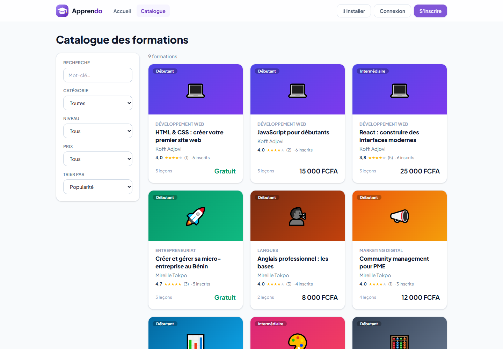
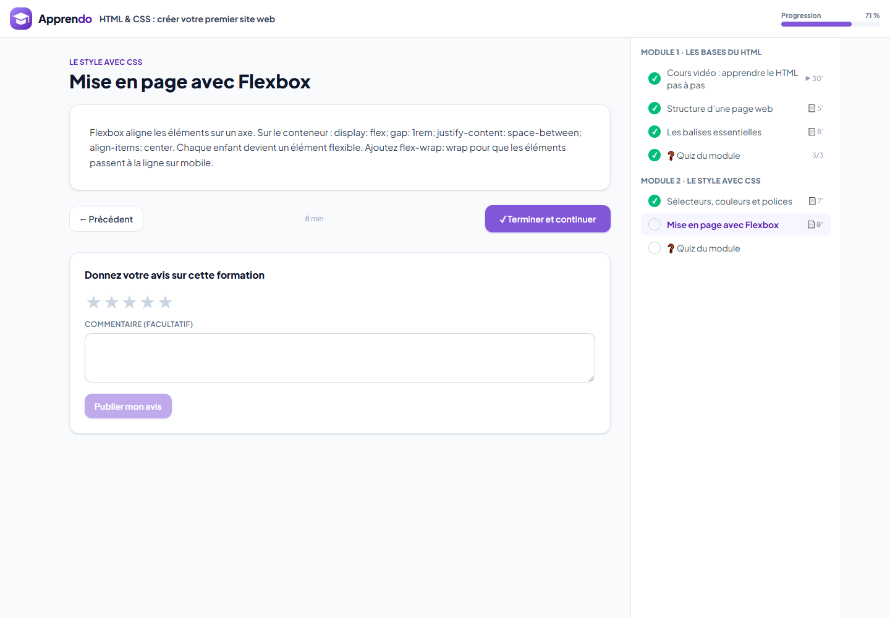
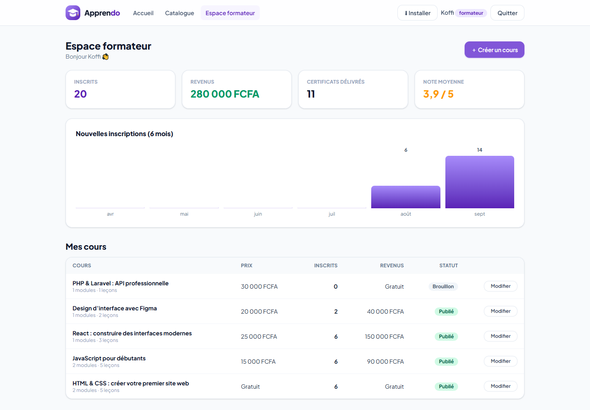

# Apprendo — Marketplace de formations en ligne (mini-LMS)

Plateforme permettant à des formateurs indépendants de créer et vendre des cours en ligne, et aux apprenants de s’inscrire
et de suivre leur progression. Projet n°8 du cahier des charges « 9 projets fictifs ».

**🔗 Démo en ligne :** https://mes-apps.wuaze.com/apprendo/ — **📲 Installer l’application** (mobile, tablette, ordinateur) : https://mes-apps.wuaze.com/apprendo/#/installer






## Fonctionnalités (MVP)

- Authentification : **formateur** et **apprenant**
- **Création de cours par le formateur** : titre, description, catégorie, niveau, prix ; modules et leçons (texte ou vidéo YouTube/Vimeo)
- **Catalogue** avec recherche et filtres (catégorie, niveau, gratuit/payant), tri par popularité, note, nouveauté ou prix
- **Inscription** à un cours, gratuit ou payant (paiement simulé)
- **Suivi de progression** : leçons terminées, pourcentage d’avancement, reprise là où l’on s’est arrêté
- Espace **« Mes cours »** côté apprenant

## Fonctionnalités avancées (bonus)

- **Quiz de fin de module** avec score (seuil de réussite de 60 %), correction affichée, tentatives illimitées
- **Certificat de complétion** généré automatiquement en PDF (DomPDF), avec numéro unique et **page de vérification publique**
- **Avis et notation** des cours par les apprenants inscrits
- **Paiement Mobile Money** (MTN MoMo, Moov Money) pour les cours payants — simulé, aucune transaction réelle
- **Espace formateur avec statistiques** : inscrits, revenus, certificats délivrés, note moyenne, inscriptions par mois
- Aperçu gratuit de certaines leçons, prévisualisation du cours par le formateur, application installable (PWA)

## Règles métier

Le contenu d’une leçon n’est envoyé au navigateur que pour les leçons « aperçu » ou après inscription ; les bonnes réponses d’un quiz
ne sont révélées qu’après la validation ; un cours est terminé quand **toutes les leçons sont faites et tous les quiz réussis** ;
un cours brouillon est invisible du public ; un cours qui a des inscrits ne peut plus être supprimé ; seul le formateur propriétaire
modifie son cours.

## Stack

| Composant | Technologie |
|---|---|
| Backend / API | Laravel 12, Sanctum |
| Frontend | React 19 + Vite + Tailwind CSS 4 (dossier `frontend/`) |
| Vidéo | Intégration YouTube / Vimeo (simplifie l’hébergement pour un MVP) |
| Base de données | MySQL |
| PDF | DomPDF |

Modèle de données : `users (role)`, `cours`, `modules`, `lecons`, `quiz` + `quiz_questions`, `inscriptions`, `progressions`, `tentatives`, `avis_cours`.
Documentation de l’API : [`docs/Apprendo.postman_collection.json`](docs/Apprendo.postman_collection.json).

## Installation

```bash
composer install
cp .env.example .env            # renseignez la base MySQL
php artisan key:generate
php artisan migrate --seed      # 9 formations (avec 3 vidéos YouTube), 3 formateurs, 8 apprenants, progressions et avis
php artisan serve
```

L’interface est déjà compilée dans `public/spa` (`cd frontend && npm install && npm run build` pour la modifier).
Tests : `php artisan test` (10 tests : verrouillage du contenu, paiement, progression, quiz, certificat, droits, validation).

## Comptes de démonstration

| Rôle | E-mail | Mot de passe |
|---|---|---|
| Apprenante (cours entamés) | `apprenant@apprendo.bj` | `demo1234` |
| Formateur (9 cours dont 1 brouillon) | `formateur@apprendo.bj` | `demo1234` |

Formateurs, apprenants, paiements et certificats sont fictifs. Les vidéos sont des intégrations de vidéos YouTube publiques
(freeCodeCamp, Programming with Mosh) affichées à titre d’exemple ; elles restent la propriété de leurs auteurs.

Auteur : [Sedjame Vianney](https://sedjame-vianney.vercel.app)
